# Tasketai | Prototype

This Python program is a prototype for Tasketai, a tool aimed at improving to-do list management.
It focuses on the core feature of daily task prioritization and suggestion, using several data points to assist users with task selection.

---

## Contents

- [Installation](#installation)
- [Usage](#usage)
  - [Navigation](#navigation)
- [Options](#options)
  - [Main Menu](#main-menu)
  - [Velocity](#velocity)
  - [Suggest Tasks](#suggest-tasks)
  - [Add Task](#add-task)
  - [View Task Backlog](#view-task-backlog)
  - [Settings](#settings)
- [Issues and Missing Features](#issues-and-missing-features)
  - [Issues](#issues)
  - [Missing Features](#missing-features)

---

## Installation

Install dependencies with the following command
```
pip install -r requirements.txt
```

---

## Usage

Run the program with the following command
```
python tasketai.py
```

Running the program will display the [Main Menu](#main-menu). The options that are displayed depend on the user's current state.


## Navigation

- Navigate menus using the `↑`/`↓` arrow keys.
- Select a highlighted option by pressing `⏎`/`Enter`.
- Return to a previous menu with `Ctrl + C` or by selecting `Back` from a sub-menu.
- Cancel an input prompt with `Ctrl + C`.
- Exit the program using `Ctrl + C` or by selecting `Quit` from the main menu.

_Thank you to the [inquirer](https://pypi.org/project/inquirer/) Python module for offering these beautiful and easy-to-use menus!_

---

## Options

### Main Menu

There are several static options in the main menu that are always available. These options are:
- [Add Task](#add-task)
- [View Task Backlog](#view-task-backlog)
- [Settings](#settings)
- Quit

The following options will only display if certain requirements have been met:
- [Velocity](#velocity)
- [Suggest Tasks](#suggest-tasks)

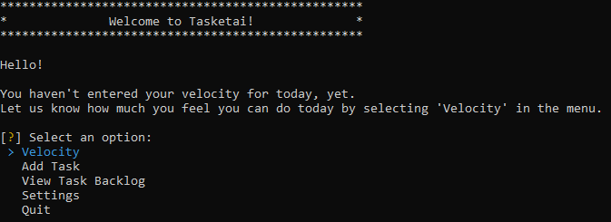

### Velocity

The `Velocity` option will be available if you have not yet entered your velocity for the day.

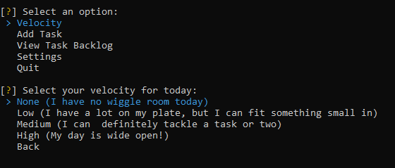

### Suggest Tasks

The `Suggest Tasks` option will only be available if you have entered your velocity for the day **_and_** the combined effort of your selected tasks is lower than your velocity.

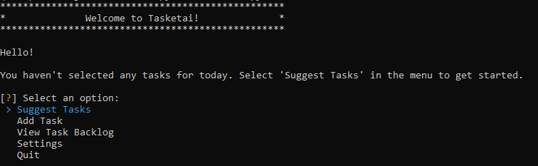

For example, if you have selected a `[HIGH]` velocity and a single task of `[LOW]` effort, the `Suggest Task` option will still be available.

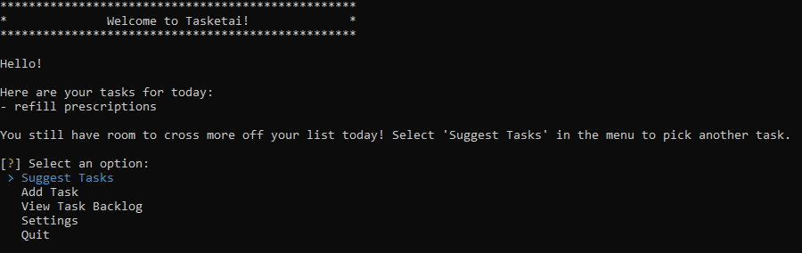

You will not be able to select tasks in which their combined effort exceeds your velocity.

If the combined effort of your selected tasks equal your velocity, or you selected a velocity of `[NONE]`, the `Suggest Task` option will no longer be available.

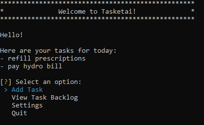


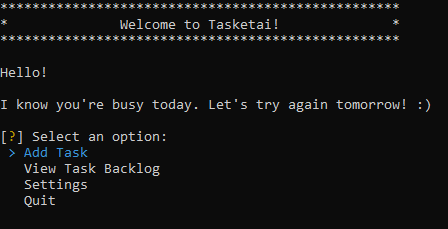


Choosing the `Select Task` option will return a list of the top 3 suggested tasks based on their prioritization ranking and your remaining available velocity.
These tasks are prefixed with their effort value, represented as `[HIGH]`, `[MED]`, or `[LOW]`.

You may either select one of the suggested tasks, `See more` to get the next 3 suggestions, or `Back` to return to the `Main Menu`.

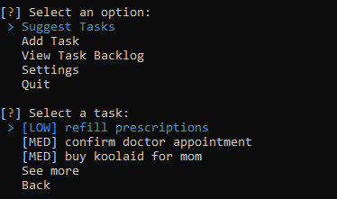

### Add Task

Select this option to add a task to your backlog.

You will be prompted for the following input:
- `Title` The name or title of the task. Must be between 1 and 256 characters.
- `Urgency` How urgent the task is on a scale of 1-5, with 1 being not urgent and 5 being very urgent.
- `Importance` How important the task is on a scale of 1-5, with 1 being not important and 5 bein very important.
- `Effort` How much effort the task will take to complete on a scale of 1-3, with 1 being low effort and 3 being high effort.

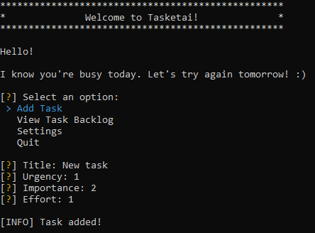

Values for all 4 inputs are required to successfully save the task. Cancelling with `Ctrl+C` before the task is saved will discard any current input and return you to the `Main Menu`.

### View Task Backlog

Selecting `View Task Backlock` will display a paginated view of your task backlog in the order they were added. The maximum number of tasks displayed per page is 20.

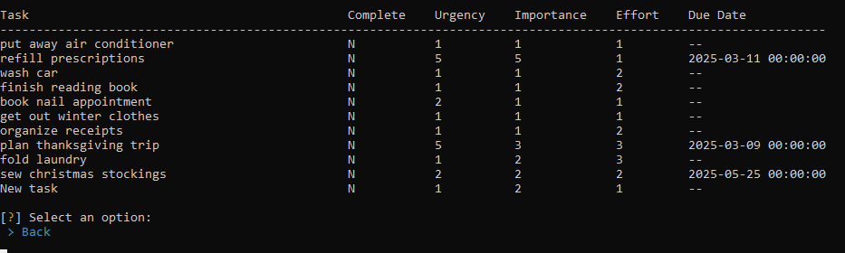

The `See more` option is only available if you have more tasks to view.

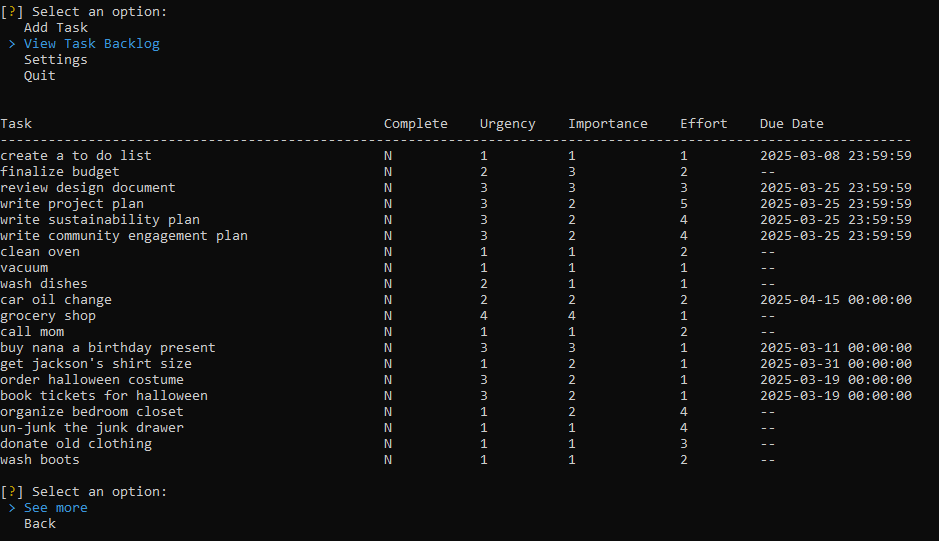

### Settings

Select this option to view and update user settings.

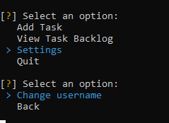

#### Change Username

Select this option to add or update your username.

To delete your current username, leave the input field blank.

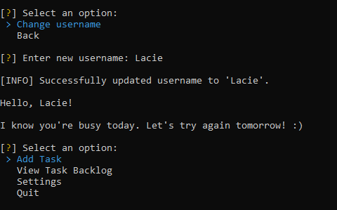


---

## Issues and Missing Features

This prototype is a proof of concept, and as such, it's missing some core features and functionality.

The following section highlights some of the known issues and limitations, acknowledging key areas for future development.
Keep in mind that this is not an exhaustive list, but rather a summary of the most prominent concerns.

### Issues

1. Data is stored in unprotected local files
   - User data is stored as a local JSON file, and the task backlog is stored as a local CSV file
   - Any changes or modification to these files directly can result in crashes and errors
   - Running multiple instances of the program simultaneously can lead to race conditions and/or data inconsistencies
2. Usernames do not have input validation
3. Task ranking algorithm uses hard-coded weights and values
4. User is expected to know the meaning of terms like urgency, importance, effort, and velocity

### Missing Features

The following intended features were not implemented in this prototype:
1. Due date input when adding tasks
2. Marking tasks as complete
3. Modifying or deleting tasks
4. Modifying velocity
5. Unselecting tasks/moving tasks back to the backlog
6. Additional user settings, such as:
   - Task page limits
   - Task suggestion weights